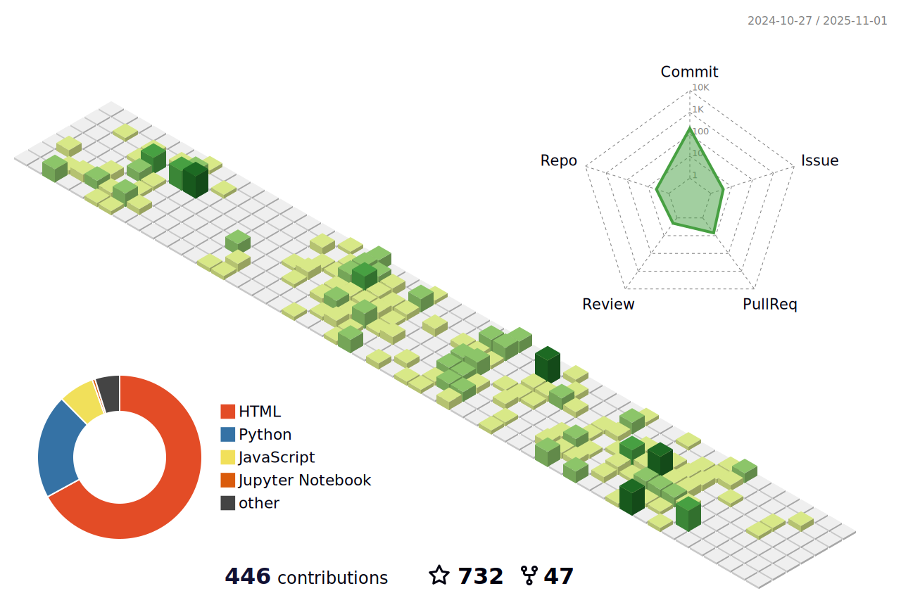

## Hi, I'm thinkwee (Wei Liu)
 

### 🎓 Bio
- Acquired Master of Computer Engineering at CIST@BUPT(Center of Intelligence Science and Technology@Beijing University of Posts and Telecommunications)
- Worked as NLP Researcher at [Tencent](https://www.tencent.com/en-us/about.html)
- Working at [THUNLP](https://nlp.csai.tsinghua.edu.cn/) as a RA

### 🔥 Projects

| Project | Stars | Forks | Introduction |
| :----:  | :----: | :----: | :---- |
| [ChatDev](https://github.com/OpenBMB/ChatDev) |  |  | Create Customized Software in Natural Language Ideas |
| [Awesome-Chinese-LLM](https://github.com/HqWu-HITCS/Awesome-Chinese-LLM) |  |  | An Awesome list of Chinese LLMs |

### 🔧 Other Works
- [UniKeyphrase](https://github.com/thinkwee/UniKeyphrase)
- [GPT_Debate](https://github.com/thinkwee/GPT_debate)
- [DPP_CNN_Summarization](https://github.com/thinkwee/DPP_CNN_Summarization)
- [SubjevtiveBiasABS](https://github.com/thinkwee/SubjectiveBiasABS)
- [multiling_wiki](https://github.com/thinkwee/multiling2019_wiki)

### 🛏️ Living on the Github

