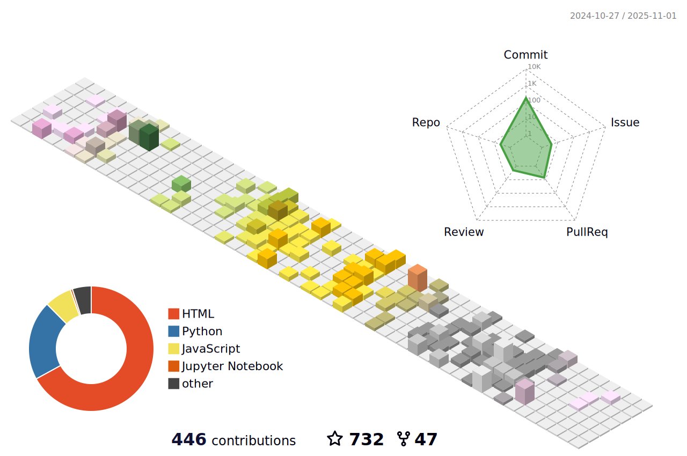

## Hi, i'm thinkwee, Application Researcher in Tencent

 

### Intro
- 🔭 Acquired Master of Computer Engineering at CIST@BUPT(Center of Intelligence Science and Technology)
- 🚀 Now working at MLPD of Tencent 🤖@🐧
- 🌱 I’m interested in text generation, pre-training, advertisement
### Some works
- 📙 [DPP_CNN_Summarization](https://github.com/thinkwee/DPP_CNN_Summarization)
- 📘 [SubjevtiveBiasABS](https://github.com/thinkwee/SubjectiveBiasABS)
- 📗 [UniKeyphrase](https://github.com/thinkwee/UniKeyphrase)
- 📕 [multiling_wiki](https://github.com/thinkwee/multiling2019_wiki)
- 📒 [eda_zh_bert](https://github.com/thinkwee/eda_zh_bert)

<!--  -->
